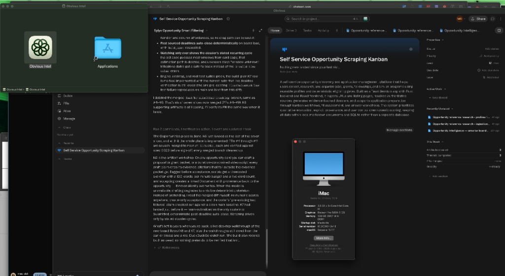

# Obvious Intel Builder for macOS (Unofficial)

Build an Intel-compatible desktop wrapper for Obvious on x86_64 Macs.



Built by **m.j. zilla**  
subscribe for more tools and insights [mecxist.substack.com](https://mecxist.substack.com/)

## Disclaimer

This is an **unofficial builder** provided for **educational and testing purposes**.
It is not affiliated with or endorsed by Obvious. Use at your own risk.

The builder creates a separate Intel-compatible desktop wrapper. It does **not** modify or convert the original Obvious app.

## What You're Downloading

This repository is not the finished Obvious Intel app.

It contains the source code and build tools used to create **Obvious Intel.app**, an Intel-compatible desktop wrapper for Obvious.

In short:

**this repository = the builder**

**Obvious Intel.app = the wrapper the builder creates**

The builder creates an x86_64 macOS application locally on your Intel Mac.

### What the wrapper is intended to support

**Obvious Intel.app** is intended to support the main Obvious experience, including:

- signing in
- opening the Obvious app
- projects and agents
- files and workbooks
- links that need to open in your browser
- chat speech-to-text (microphone dictation)
- supported desktop features used by the Obvious web interface

### Meeting capture on Intel

Recall.ai does not provide the x86_64 Intel Mac build required for this builder, so the official Obvious meeting-recording path remains unavailable.

**[Tacet](https://github.com/Tacetapp/tacet)** is the open-source companion this builder uses instead of Recall for Intel meeting capture, recording, and recap. The Intel companion work is on [`feature/intel-meeting-capture-addon`](https://github.com/mecxist/obvi_intel/tree/feature/intel-meeting-capture-addon), and that work is already included in the default builder on [`main`](https://github.com/mecxist/obvi_intel).

It is not a drop-in replacement for Recall inside the Obvious meeting button. **Obvious Intel.app** still reports the official Recall capability as unavailable, and Tacet is launched beside it for recording and recap.

Tacet is an independent MIT-licensed project with explicit Intel Mac support. It can capture system audio and microphone audio, collect screen frames, transcribe with faster-whisper on Intel, and add speaker identification, summaries, and meeting analysis.

The builder does not copy or rename Tacet. Tacet stays a separate upstream project so it can receive its own updates.

### Chat speech-to-text

The official Obvious site in a normal browser already had working chat dictation. Early Intel wrapper builds did not, and showed:

```text
Microphone is not supported in this browser
```

That message came from the Obvious web app, not from macOS. Chat dictation needs `navigator.mediaDevices.getUserMedia`. The WKWebView used by this wrapper leaves that API off unless WebKit's private `mediaDevicesEnabled` preference is set **before** the window is created.

The builder now creates the main window in Rust with that preference on, then still asks macOS for microphone access. Rebuild **Obvious Intel.app** from current `main`, quit any older copy, and open the new app. macOS may prompt for the microphone the first time you use dictation.

---

# Quick Start

You do **not** need to know how to code to try this.

You will use the **Terminal** app on your Mac, but you can copy and paste the commands below exactly as shown.

## Before you start

You need:

- an **Intel Mac**
- macOS
- an internet connection
- this builder downloaded to your Mac

The builder also uses a few free developer tools. If one of them is missing, the build may stop and tell you what is missing. See **Setup Help** farther down this page.

## 1. Download this builder

Download the repository from GitHub.

If it downloads as a ZIP file, double-click the ZIP to open it.

You should now have a folder for this builder somewhere on your Mac, usually in **Downloads**.

## 2. Open Terminal

1. Press **Command + Space** on your keyboard.
2. Type **Terminal**.
3. Press **Return**.

A Terminal window will open.

## 3. Tell Terminal where you downloaded this builder

The easiest way is to use Finder instead of typing the folder location yourself.

1. In Terminal, type:

```bash
cd 
```

Make sure there is a space after `cd`.

2. Open Finder and locate the builder folder you downloaded.
3. Drag that folder directly into the Terminal window.
4. Press **Return**.

Terminal is now working inside the correct folder.

> If GitHub named the folder `obvi_intel` and it is in Downloads, you can also paste this instead:
>
> ```bash
> cd ~/Downloads/obvi_intel
> ```

## 4. Allow the included builder to run

macOS may prevent a newly downloaded command file from running until you give it permission.

Copy and paste this into Terminal, then press **Return**:

```bash
chmod +x ./scripts/build-intel.sh ./scripts/inspect-official.sh ./scripts/setup-tacet.sh ./scripts/run-tacet.sh
```

This tells macOS that these included command files are allowed to run on your Mac.

**Nothing may appear to happen after you press Return. That is normal.**

You only need to do this once for this downloaded copy of the builder.

## 5. Build Obvious Intel

Copy and paste this into Terminal, then press **Return**:

```bash
./scripts/build-intel.sh
```

Terminal will begin showing lines of text while it builds the wrapper. That is normal.

Keep the Terminal window open until the command finishes and you can type into Terminal again.

If the build succeeds, it creates:

```text
Obvious Intel.app
```

## 6. Find the finished app

The finished wrapper is normally placed inside the builder's build folder.

To open that folder without searching for it yourself, copy and paste this into Terminal:

```bash
open src-tauri/target/x86_64-apple-darwin/release/bundle/macos/
```

A Finder window should open showing:

```text
Obvious Intel.app
```

## 7. Open Obvious Intel

Double-click **Obvious Intel.app**.

Because this is an unofficial app you built locally, macOS may block it the first time.

If macOS says the app cannot be opened:

1. Find **Obvious Intel.app** in Finder.
2. Right-click it, or hold **Control** and click it.
3. Choose **Open**.
4. Choose **Open** again if macOS asks for confirmation.

You should only need to do this once.

## 8. Sign in and try Obvious

Once the app opens, sign in with your normal Obvious account.

Good first things to test are:

1. Open an existing project.
2. Create or open an agent.
3. Open files or workbooks.
4. Click links that should open in your normal browser.
5. Use Obvious normally and note anything that does not work.

The official Recall.ai meeting-recording path remains unavailable on Intel. For meeting recording and recap, see **Tacet Companion** below.

---

# Tacet Companion

Tacet provides Intel meeting capture and recap as a companion app. It is part of the default builder on `main`, and it is not a replacement for Recall inside the Obvious meeting button.

Install or update Tacet:

```bash
./scripts/setup-tacet.sh
```

By default it is placed at:

```text
~/.local/share/obvious-intel/tacet
```

Run Tacet's own one-time setup:

```bash
cd ~/.local/share/obvious-intel/tacet
./setup.sh
```

On an Intel Mac, Tacet selects its CPU-compatible `faster-whisper` transcription path.

After setup, launch it from this builder with:

```bash
./scripts/run-tacet.sh
```

Tacet remains a separate upstream project rather than being copied into this builder. See the [Tacet repository](https://github.com/Tacetapp/tacet), this builder's [Intel meeting-capture branch](https://github.com/mecxist/obvi_intel/tree/feature/intel-meeting-capture-addon), and `docs/tacet-integration.md` for the integration architecture and the documented CaptureHelper protocol.

---

# Setup Help

If the build works, you can ignore this section.

Use this section only if Terminal tells you that something is missing.

## Check the tools the builder needs

Copy and paste these commands into Terminal one at a time:

```bash
xcode-select -p
rustc --version
cargo --version
node --version
npm --version
```

If a command shows a version number or file location, that tool is installed.

If Terminal says **command not found**, use the matching instructions below.

### If Apple Command Line Tools are missing

Paste:

```bash
xcode-select --install
```

Follow the installation window that appears. When installation is complete, close and reopen Terminal and try the build again.

### If Terminal says `rustc: command not found` or `cargo: command not found`

Rust is missing from your Mac.

Install Rust, then close and reopen Terminal before trying the build again.

### If Terminal says `node: command not found` or `npm: command not found`

Node.js is missing from your Mac.

Install Node.js, then close and reopen Terminal before trying the build again.

### If Terminal says the Intel Rust target is missing

Paste:

```bash
rustup target add x86_64-apple-darwin
```

Then start the build again:

```bash
./scripts/build-intel.sh
```

---

# Troubleshooting

## Terminal says `Permission denied`

This usually means Step 4 was skipped.

Paste:

```bash
chmod +x ./scripts/build-intel.sh ./scripts/inspect-official.sh ./scripts/setup-tacet.sh ./scripts/run-tacet.sh
```

Then try the build again:

```bash
./scripts/build-intel.sh
```

## Terminal says `No such file or directory`

Terminal is probably not inside the builder folder.

Go back to **Step 3** and drag the builder folder into Terminal after typing `cd `.

Then try the command again.

## The build finished, but I cannot find Obvious Intel

Paste:

```bash
open src-tauri/target/x86_64-apple-darwin/release/bundle/macos/
```

That should open the folder containing **Obvious Intel.app**.

## macOS will not open the app

Right-click **Obvious Intel.app** in Finder and choose **Open** instead of double-clicking it.

If macOS still blocks it, open:

**System Settings → Privacy & Security**

Look for a message about **Obvious Intel** and choose the option that allows it to open.

## Obvious opens, but a feature does nothing

That may be a feature the wrapper does not support yet.

If you report the problem, include:

- what you clicked
- what you expected to happen
- what happened instead
- any error message you saw

## Chat speech-to-text says the microphone is not supported

That was a wrapper bug, not an Obvious account problem. Older builds never turned on WebKit's media-devices API, so the chat UI thought it was running in a browser without a microphone.

Rebuild **Obvious Intel.app** from current `main`, quit the old app completely, and open the new one. Allow microphone access if macOS asks. See **Chat speech-to-text** above.

## The Obvious meeting button still says recording is unavailable

That is expected. Recall.ai does not provide an Intel Mac build, and **Obvious Intel.app** does not pretend that official path works.

Use Tacet as the meeting-recording and recap companion. See **Tacet Companion** above. A closer in-app adapter to Tacet is still being developed.

## The build stops with an error

Look at the final few lines shown in Terminal. The last error is usually the most useful one.

If you need help, copy the error message before closing Terminal.

Still stuck? Message me on Substack: [mecxist.substack.com](https://mecxist.substack.com/)

---

# Optional: Inspect the Official Obvious App

**Most users do not need this section.**

You do not need the official Apple Silicon DMG to build **Obvious Intel.app**.

This tool is included for developers who want to compare the wrapper with a current official Obvious release.

If you have an official Obvious DMG, run:

```bash
./scripts/inspect-official.sh /path/to/Obvious_0.34.1_aarch64.dmg
```

For example, if the DMG is in Downloads:

```bash
./scripts/inspect-official.sh ~/Downloads/Obvious_0.34.1_aarch64.dmg
```

The tool creates:

```text
obvious-official-report.txt
```

This can help identify changes in future Obvious releases that may need to be added to the wrapper.

---

# For Developers

The generated **Obvious Intel.app** is a **Tauri 2** compatibility wrapper built for:

```text
x86_64-apple-darwin
```

It loads the Obvious web application and includes an initial compatibility layer for desktop commands such as configuration, onboarding state, external links, logging, capability checks, and selected Obvious desktop UI commands.

A development compatibility workflow is:

```bash
./scripts/inspect-official.sh /path/to/Obvious_0.34.1_aarch64.dmg
./scripts/build-intel.sh
```

For meeting capture and recap, install Tacet with:

```bash
./scripts/setup-tacet.sh
```

**Obvious Intel.app** continues to expose the upstream Recall capability as unsupported while reporting whether the Tacet companion is installed. The intended next step is a narrow adapter to Tacet's documented CaptureHelper protocol, not another recorder implementation.

Then launch **Obvious Intel.app**, enable Web Inspector/devtools if needed, and test normal product flows. Missing Tauri invocations can be implemented as they are discovered.

## Why This Exists

Obvious currently targets Apple Silicon Macs. This builder explores whether the parts of the product that are not inherently Apple Silicon-specific can remain usable on Intel hardware through a compatibility wrapper.

It is intended to extend access to otherwise capable Intel Macs without bypassing Obvious authentication, subscriptions, or account controls.
